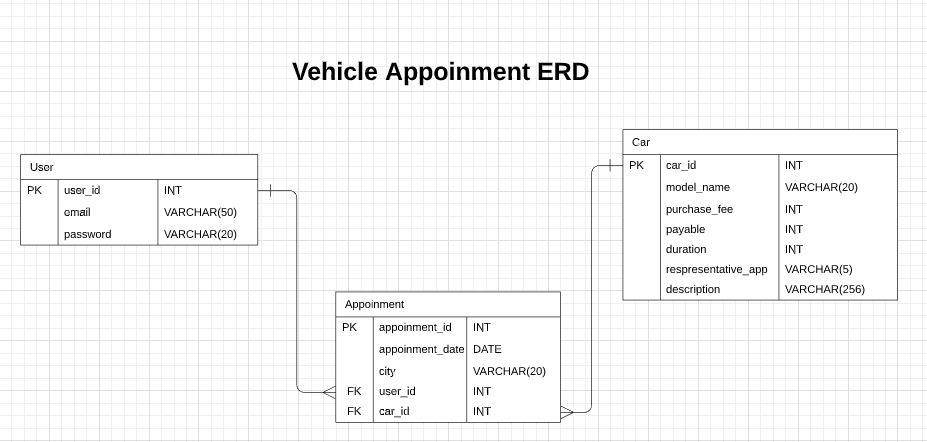

# car-viewer
___

## ERD

An API(Application Program Interface) build with Ruby on Rails. Based on users requested path, it renders related data in JSON format. 

## Table of Contents

- [What It Does?](#what-it-does?)
- [Background](#background)
- [Install](#install)
- [Usage](#usage)
- [API](#api)
- [Useage](#useage)
- [Maintainers](#maintainers)
- [Contributing](#contributing)
- [License](#license)

## What It Does?

1. Takes username, email, password to register a user.
2. User authentication coverd by taking email and password.
3. Renders a list of cars with related informations. Such as, 
    - Car model 
    - Price 
    - Payable price 
    - Minimum deposit to test a car 
    - Representative name 
4. Users appointment info.
5. Details of a specific car model.

## Background

- Ruby [Version]- 2.7.0p0
- Rails [Version]- 6.0.2.1

## Install

1. Clone the repository, `git clone git@github.com:shshamim63/car-viewer-api.git`
2. Get into the project directory `cd car-viewer-api`.
3. Run `bundle install` to install the gem.
4. To run the surver `rails s -p 3001`.

## API

The live version of the api in [here](https://car-viewer-api.herokuapp.com/)

## Useage

Checkout the [this](https://github.com/shshamim63/car-viewer-react) repository where I have isued this api.

## Maintainers

👤 **Shakhawat Hossain**

- Github: [@shshamim63](https://github.com/shshamim63)
- LinkedIn: [@shakhawathossainshamim](https://www.linkedin.com/in/shakhawathossainshamim/)
- Twitter: [@Shshamim090](https://twitter.com/Shshamim090)

## Contributing

**Always welcome to contribute if you want to make it better.**
1. Fork it (https://github.com/shshamim63/car-viewer-api)
2. Create your feature branch (git checkout -b feature/[choose-a-name])
3. Commit your changes (git commit -am 'what this commit will fix/add')
4. Push the branch (git push origin feature/[chosen-name])
5. Create a new Pull Request

Small note: If editing the README, please conform to the [standard-readme](https://github.com/RichardLitt/standard-readme) specification.

## License

MIT © 2020 Shakhawat Hossain
